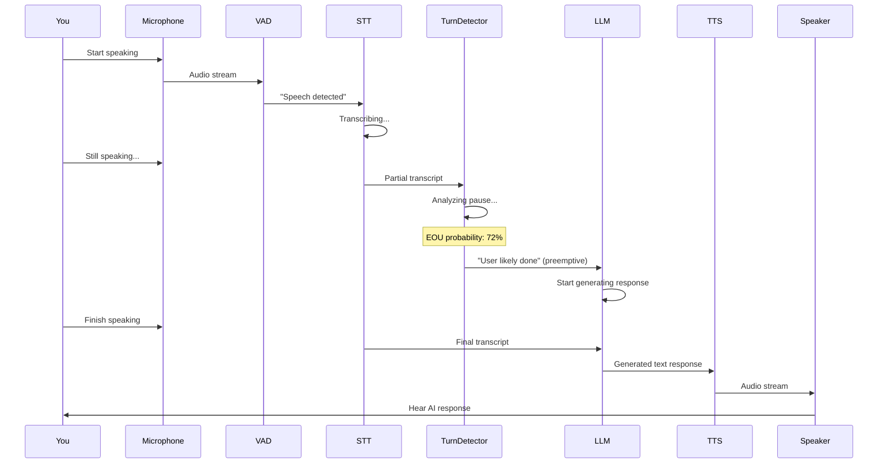
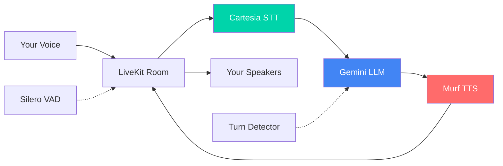

# Real-Time Voice Assistant Pipeline Architecture

## Overview

This document explains how the voice assistant works in real-time, from capturing your speech to generating and playing the AI's response.

## Pipeline Components

### 1. Speech-to-Text (STT) - Your Ears 👂

**Implementation:**
```python
stt=cartesia.STT(model="ink-whisper")
```

**What it does:** Converts your spoken words into text

**Model:** Cartesia's "ink-whisper" 

**How it works:**
- Your microphone captures audio
- Audio is streamed to Cartesia's STT service
- The model transcribes speech to text in real-time
- Typical processing: ~27.85 seconds of audio

**Key Metrics:**
- `audio_duration`: Time spent processing audio
- `transcription_delay`: ~0.35 seconds

---

### 2. Voice Activity Detection (VAD) - Listening Intelligence 🎤

**Implementation:**
```python
vad=ctx.proc.userdata["vad"]  # Silero VAD
```

**What it does:** Detects when you're speaking vs. when you're silent

**Model:** Silero VAD

**Purpose:** Knows when to start/stop listening to avoid cutting you off mid-sentence

---

### 3. Turn Detection - Conversation Flow 🔄

**Implementation:**
```python
turn_detection=MultilingualModel()
```

**What it does:** Determines when you've finished speaking (End of Utterance detection)

**How it works:**
- Uses machine learning to predict when you're done talking vs. just pausing
- Analyzes speech patterns, pauses, and intonation
- Generates an EOU (End of Utterance) probability score

**Key Metrics:**
- `end_of_utterance_delay`: ~0.71 seconds
- `eou_probability`: Confidence score (e.g., 0.7278 = 72.78% confident you finished)

---

### 4. Large Language Model (LLM) - The Brain 🧠

**Implementation:**
```python
llm=google.LLM(model="gemini-2.5-flash")
```

**What it does:** Processes your text input and generates intelligent responses

**Model:** Google's Gemini 2.5 Flash

**Key Metrics:**
- `ttft` (Time To First Token): ~1.71 seconds - how fast it starts responding
- `prompt_tokens`: Your input + conversation history (e.g., 440 tokens)
- `completion_tokens`: AI's response length (e.g., 502 tokens)
- `tokens_per_second`: Generation speed (~0.58 tokens/sec)

**Instructions:**
```python
instructions="""You are a helpful voice AI assistant. The user is interacting with you via voice, 
even if you perceive the conversation as text. You eagerly assist users with their questions by 
providing information from your extensive knowledge. Your responses are concise, to the point, 
and without any complex formatting or punctuation including emojis, asterisks, or other symbols.
You are curious, friendly, and have a sense of humor."""
```

---

### 5. Text-to-Speech (TTS) - The Voice 🗣️

**Implementation:**
```python
tts=murf.TTS(
    voice="en-US-matthew", 
    style="Conversation",
    tokenizer=tokenize.basic.SentenceTokenizer(min_sentence_len=2),
    text_pacing=True
)
```

**What it does:** Converts the AI's text response into natural-sounding speech

**Model:** Murf's FALCON with "Matthew" voice in conversational style

**Features:**
- **Sentence Tokenizer**: Breaks text into sentences for streaming
- **Text Pacing**: Adds natural pauses and rhythm
- **Streaming**: Starts playing audio as soon as first sentence is ready

**Key Metrics:**
- `ttfb` (Time To First Byte): ~0.628 seconds - how fast audio starts playing
- `audio_duration`: Length of generated speech (e.g., 0.56 seconds)
- `characters_count`: Total characters converted to speech

---

### 6. Preemptive Generation ⚡ (Speed Optimization)

**Implementation:**
```python
preemptive_generation=True
```

**What it does:** Starts generating the LLM response **before** you finish speaking

**How it works:**
- When turn detection is ~70% confident you're done speaking
- The LLM starts processing your input early
- Reduces perceived latency significantly

**Key Metric:**
- `preemptive_lead_time`: ~0.358 seconds of head start

---

## Complete Real-Time Flow

### Sequence Diagram



### Step-by-Step Process

1. **You start speaking** → Microphone captures audio
2. **VAD activates** → Detects speech vs. silence
3. **STT begins transcription** → Converts audio to text in real-time
4. **Turn detector monitors** → Analyzes if you're done speaking
5. **Preemptive generation triggers** → LLM starts early (~70% confidence)
6. **You finish speaking** → Final transcript sent to LLM
7. **LLM generates response** → Processes context and creates reply
8. **TTS converts to speech** → Text becomes audio
9. **Audio streams to you** → You hear the response

---

## Architecture Diagram



---

## Performance Metrics

### Typical Session Metrics

| Metric | Value | What it means |
|--------|-------|---------------|
| **End of Utterance Delay** | 0.71s | How long after you stop talking before AI responds |
| **Transcription Delay** | 0.35s | How long STT takes to process your speech |
| **LLM TTFT** | 1.71s | How fast the AI starts thinking |
| **TTS TTFB** | 0.628s | How fast the voice starts playing |
| **Preemptive Lead Time** | 0.358s | Head start for LLM processing |

### Example Session Statistics

From a real conversation session:

```
Usage Summary:
- LLM Prompt Tokens: 3,246
- LLM Completion Tokens: 502
- TTS Characters: 1,337
- TTS Audio Duration: 71.28 seconds
- STT Audio Duration: 217.65 seconds (user speaking time)
```

---

## Why It Feels Real-Time

The system achieves low latency through several optimizations:

### 1. **Streaming Architecture**
Everything streams (audio, text, responses) - no waiting for complete sentences or paragraphs

### 2. **Preemptive Generation**
AI starts thinking before you finish speaking, reducing perceived latency

### 3. **Fast Models**
- Gemini 2.5 Flash is optimized for speed
- Cartesia's ink-whisper provides fast transcription
- Murf's FALCON generates natural speech quickly

### 4. **Sentence Tokenization**
```python
tokenizer=tokenize.basic.SentenceTokenizer(min_sentence_len=2)
```
TTS starts speaking as soon as it has a complete sentence, not waiting for the entire response

### 5. **WebRTC Protocol**
LiveKit uses WebRTC for ultra-low-latency audio streaming between browser and server

### 6. **Noise Cancellation**
```python
noise_cancellation=noise_cancellation.BVC()
```
Improves audio quality, reducing transcription errors

---

## Technology Stack

### Backend Components

| Component | Technology | Purpose |
|-----------|-----------|---------|
| **Framework** | LiveKit Agents | Orchestrates the entire pipeline |
| **STT** | Cartesia (ink-whisper) | Speech-to-text conversion |
| **LLM** | Google Gemini 2.5 Flash | Natural language understanding & generation |
| **TTS** | Murf (FALCON, Matthew voice) | Text-to-speech synthesis |
| **VAD** | Silero | Voice activity detection |
| **Turn Detection** | MultilingualModel | End-of-utterance detection |
| **Noise Cancellation** | BVC | Audio quality improvement |

### Frontend Components

| Component | Technology | Purpose |
|-----------|-----------|---------|
| **Framework** | Next.js 15 + React 19 | Web application framework |
| **UI Library** | LiveKit Components React | Pre-built voice UI components |
| **Real-time Communication** | LiveKit Client SDK | WebRTC audio streaming |
| **Transcript Display** | Custom ChatTranscript component | Shows conversation text |
| **Styling** | Tailwind CSS | Modern, responsive design |

---

## Code Reference

### Agent Configuration

The complete agent setup is in [`backend/src/agent.py`](file:///c:/SmartQ/ten-days-of-voice-agents-2025/backend/src/agent.py):

```python
session = AgentSession(
    stt=cartesia.STT(model="ink-whisper"),
    llm=google.LLM(model="gemini-2.5-flash"),
    tts=murf.TTS(
        voice="en-US-matthew", 
        style="Conversation",
        tokenizer=tokenize.basic.SentenceTokenizer(min_sentence_len=2),
        text_pacing=True
    ),
    turn_detection=MultilingualModel(),
    vad=ctx.proc.userdata["vad"],
    preemptive_generation=True,
)
```

### Frontend Transcript

The transcript display uses [`useChatMessages`](file:///c:/SmartQ/ten-days-of-voice-agents-2025/frontend/hooks/useChatMessages.ts) hook:

```typescript
export function useChatMessages() {
  const chat = useChat();
  const room = useRoomContext();
  const transcriptions: TextStreamData[] = useTranscriptions();

  const mergedTranscriptions = useMemo(() => {
    const merged: Array<ReceivedChatMessage> = [
      ...transcriptions.map((transcription) => transcriptionToChatMessage(transcription, room)),
      ...chat.chatMessages,
    ];
    return merged.sort((a, b) => a.timestamp - b.timestamp);
  }, [transcriptions, chat.chatMessages, room]);

  return mergedTranscriptions;
}
```

---

## Optimization Opportunities

### Reduce Latency Further

1. **Use Realtime API** (OpenAI Realtime or similar)
   - Single model handles STT + LLM + TTS
   - Can reduce latency to ~500ms

2. **Adjust Turn Detection Sensitivity**
   - Lower EOU threshold for faster responses
   - Trade-off: might interrupt user more

3. **Use Faster LLM**
   - Gemini 2.0 Flash Thinking (experimental)
   - GPT-4o mini for simpler tasks

4. **Optimize TTS Settings**
   - Reduce `min_sentence_len` for faster streaming
   - Use lower quality audio for speed

### Improve Quality

1. **Better Context Management**
   - Add conversation history
   - Implement memory/RAG

2. **Enhanced Turn Detection**
   - Fine-tune EOU parameters
   - Add custom interruption handling

3. **Voice Customization**
   - Try different Murf voices
   - Adjust speaking rate and pitch

---

## Monitoring & Debugging

### Key Logs to Watch

```python
@session.on("metrics_collected")
def _on_metrics_collected(ev: MetricsCollectedEvent):
    metrics.log_metrics(ev.metrics)
    usage_collector.collect(ev.metrics)
```

### Important Metrics

- **STT metrics**: `audio_duration`, transcription quality
- **LLM metrics**: `ttft`, `tokens_per_second`, token counts
- **TTS metrics**: `ttfb`, `audio_duration`, character counts
- **Turn detection**: `eou_probability`, `end_of_utterance_delay`

### Debug Mode

Enable debug logging in [`session-view.tsx`](file:///c:/SmartQ/ten-days-of-voice-agents-2025/frontend/components/app/session-view.tsx):

```typescript
const IN_DEVELOPMENT = process.env.NODE_ENV !== 'production';
useDebugMode({ enabled: IN_DEVELOPMENT });
```

---

## Resources

- [LiveKit Agents Documentation](https://docs.livekit.io/agents/)
- [LiveKit Models - STT](https://docs.livekit.io/agents/models/stt/)
- [LiveKit Models - LLM](https://docs.livekit.io/agents/models/llm/)
- [LiveKit Models - TTS](https://docs.livekit.io/agents/models/tts/)
- [Turn Detection Guide](https://docs.livekit.io/agents/build/turns)
- [Preemptive Generation](https://docs.livekit.io/agents/build/audio/#preemptive-generation)
- [Metrics Collection](https://docs.livekit.io/agents/build/metrics/)

---

## Summary

The real-time voice assistant achieves natural conversation through:

1. **Streaming architecture** - No waiting for complete inputs/outputs
2. **Intelligent turn detection** - Knows when you're done speaking
3. **Preemptive generation** - Starts thinking before you finish
4. **Fast, optimized models** - Each component chosen for speed
5. **LiveKit orchestration** - Seamless coordination of all components

Total typical latency from speech end to response start: **~2-3 seconds**

This creates a natural, conversational experience that feels like talking to a real person!
