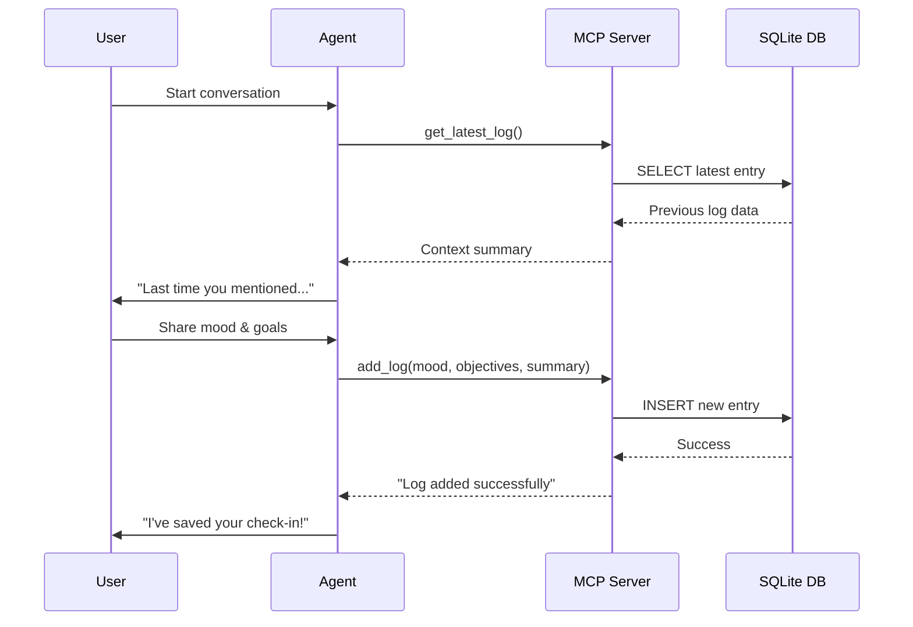

# Day 3 - Completion Report

## 📋 Task Summary

**Challenge:** Health & Wellness Voice Companion

**Date Completed:** November 24, 2025

---

## ✅ Objectives Completed

### Primary Goals
- [x] Create supportive Health & Wellness companion persona
- [x] Conduct daily check-ins (mood, energy, objectives)
- [x] Persist data to JSON/Database
- [x] Reference previous check-ins for context awareness
- [x] Provide grounded, non-medical advice

### Advanced Goals (Optional)
- [x] SQLite MCP Integration for robust data persistence
- [x] Local MCP server managing wellness database
- [x] Real-time communication via stdio transport

---

## 🛠️ Technical Implementation

### Changes Made

**Files Modified:**
- `backend/src/agent.py` - Replaced barista with wellness companion, integrated MCP client, added context loading.

**Files Created:**
- `backend/wellness_db_server.py` - FastMCP server managing SQLite database.
- `backend/wellness.db` - SQLite database for wellness logs.

### Key Code Additions

**MCP Server (wellness_db_server.py):**
```python
@mcp.tool()
def add_log(mood: str, objectives: list[str], summary: str) -> str:
    """Add a new wellness log entry."""
    conn = sqlite3.connect(DB_FILE)
    c = conn.cursor()
    timestamp = datetime.now().isoformat()
    objectives_json = json.dumps(objectives)
    c.execute("INSERT INTO logs (timestamp, mood, objectives, summary) VALUES (?, ?, ?, ?)",
              (timestamp, mood, objectives_json, summary))
    conn.commit()
    conn.close()
    return "Log added successfully."
```

**Agent (MCP Client Integration):**
```python
async with stdio_client(server_params) as (read, write):
    async with ClientSession(read, write) as session:
        await session.initialize()
        
        # Load context from MCP
        result = await session.call_tool("get_latest_log", arguments={})
        # Use result to build context_summary
        
        agent = Assistant(mcp_client=session)
        await session_agent.start(agent=agent, room=ctx.room)
```

---

## 🎯 Key Features Implemented

1. **Wellness Companion Persona**
   - Warm, empathetic, supportive tone
   - Non-medical, grounded advice
   - Structured conversation flow

2. **Daily Check-in Flow**
   - Asks about mood and energy levels
   - Collects 1-3 daily objectives
   - Provides brief encouragement
   - Confirms and saves entry

3. **SQLite MCP Integration**
   - Local MCP server spawned by agent
   - Stdio transport for communication
   - Structured database schema
   - Tools: `add_log()`, `get_latest_log()`

4. **Context Awareness**
   - Fetches previous check-in on startup
   - References past mood and goals
   - Personalized conversation continuity


---

## 🏗️ Architecture & Technologies

### Key Technologies Stack
- **LiveKit Agents SDK**: Voice pipeline orchestration
- **MCP (Model Context Protocol)**: External tool integration framework
- **SQLite3**: Lightweight embedded database for persistence
- **Google Gemini 2.5 Flash Lite**: LLM for natural conversation
- **Murf TTS (Matthew voice)**: Natural voice synthesis with conversational style
- **Cartesia STT (ink-whisper)**: Fast speech recognition
- **FastMCP**: Python framework for building MCP servers

### MCP Server Components
1. **wellness_db_server.py**: Standalone FastMCP server
2. **Tools Exposed**:
   - `add_log(mood, objectives, summary)`: Insert new wellness entry
   - `get_latest_log()`: Retrieve most recent check-in
3. **Transport**: Stdio (spawned as subprocess by agent)

---

## 🧪 Testing & Validation

### Successful Tests
- ✅ Agent successfully connects to MCP server
- ✅ Wellness logs saved to `wellness.db`
- ✅ Context loaded from previous sessions
- ✅ Agent references past check-ins naturally
- ✅ Database schema correctly stores all fields

### Database Verification
```bash
sqlite3 wellness.db "SELECT * FROM logs;"
# Output: timestamp, mood, objectives (JSON), summary
```

---

## 💡 Learnings & Insights

1. **Model Context Protocol (MCP)**
   - Learned how to create local MCP servers with FastMCP
   - Understood stdio transport for agent-server communication
   - Discovered how to integrate external tools seamlessly

2. **Agent Lifecycle Management**
   - Learned to keep MCP session alive during agent runtime
   - Implemented shutdown future to prevent premature session closure
   - Used room disconnect event for cleanup

3. **Tool Registration**
   - Discovered `@function_tool` decorator auto-registers tools
   - `Agent.__init__()` does NOT accept `functions` parameter
   - Tools are discovered automatically by `AgentSession`

---

## 🐛 Challenges Solved

### Challenge 1: Tool Registration Error
**Problem:** `TypeError: Agent.__init__() got an unexpected keyword argument 'functions'`

**Solution:** Removed `functions` parameter - tools decorated with `@function_tool` are auto-discovered.

### Challenge 2: MCP Session Lifecycle
**Problem:** MCP session closing before agent finished running

**Solution:** 
```python
shutdown_future = asyncio.Future()

@ctx.room.on("disconnected")
def on_disconnected(reason):
    if not shutdown_future.done():
        shutdown_future.set_result(None)

await shutdown_future
```

### Challenge 3: Context Loading Timing
**Problem:** Needed context before agent initialization

**Solution:** Fetch from MCP in `entrypoint`, inject into instructions string

---

## 📁 Files Changed

### Modified Files
```diff
backend/src/agent.py
- class Assistant(Agent): # Barista
+ class Assistant(Agent): # Wellness Companion
- @function_tool async def save_order(...)
+ @function_tool async def add_log(...)
+ from mcp import ClientSession, StdioServerParameters
+ async with stdio_client(server_params) as (read, write):
```

### New Files Created
- `backend/wellness_db_server.py` - MCP server implementation
- `backend/wellness.db` - SQLite database (auto-created)

---

## 🔄 Git Version Control

- **Branch:** `day-3-health-companion`
- **Commits:**
  - `29f01e4` - Day 3: Implement Health & Wellness Companion
  - `dfb2a07` - Day 3: Add SQLite MCP integration for wellness logs

---

## 📊 Database Schema

```sql
CREATE TABLE logs (
    id INTEGER PRIMARY KEY AUTOINCREMENT,
    timestamp TEXT,
    mood TEXT,
    objectives TEXT,  -- JSON array
    summary TEXT
)
```

### Data Flow Sequence



---

## 🔮 Potential Enhancements

### Future Features
1. **Weekly Reflection Tool**: Aggregate mood trends over time
2. **Goal Tracking**: Mark objectives as completed in follow-ups
3. **Reminder Integration**: Connect to calendar/task management via MCP
4. **Data Visualization**: Generate mood charts from historical data
5. **Multi-user Support**: Add user authentication and separate logs

### Advanced MCP Integrations
- **Notion MCP**: Sync wellness logs to Notion database
- **Todoist MCP**: Convert objectives into actionable tasks
- **Zapier MCP**: Trigger workflows based on mood patterns

---

## 📚 Resources

- [LiveKit Agents Documentation](https://docs.livekit.io/agents/)
- [MCP Documentation](https://modelcontextprotocol.io/docs/getting-started/intro)
- [Day 3 Task Requirements](file:///c:/SmartQ/ten-days-of-voice-agents-2025/challenges/Day%203%20Task.md)

---

## 📝 Next Steps (Day 4)

- [ ] Check Day 4 Challenge requirements
- [ ] Plan implementation

---

**Status:** ✅ Day 3 Complete (Primary + Advanced Goals)

**Overall Rating:** ⭐⭐⭐⭐⭐

---

*Generated on: November 24, 2025*
