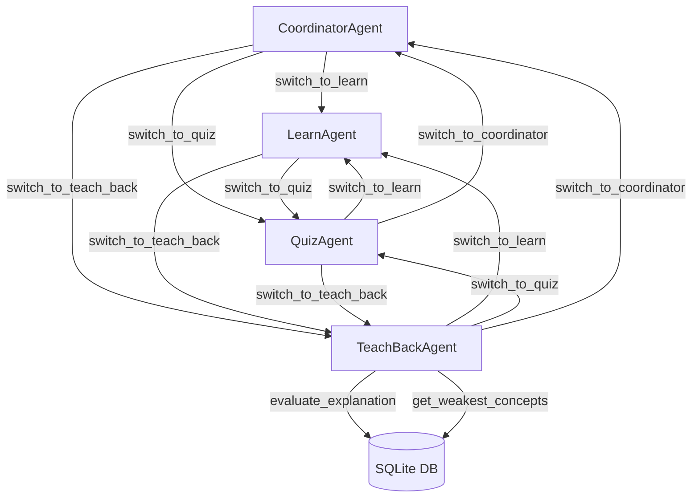
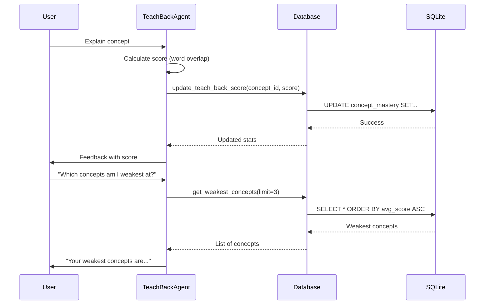

# Day 4 - Completion Report

## 📋 Task Summary

**Challenge:** Teach-the-Tutor Active Recall Coach

**Date Completed:** November 25, 2025

---

## ✅ Objectives Completed

### Primary Goals
- [x] Create multi-mode learning agent (Learn, Quiz, Teach-Back)
- [x] Implement agent handoffs between modes
- [x] Load learning content from JSON file
- [x] Use different voices for each mode (Matthew, Alicia, Ken)
- [x] Enable seamless mode switching during conversation

### Advanced Goals (Optional)
- [x] Richer concept mastery model tracking scores and statistics
- [x] Teach-back evaluator tool with automated scoring
- [x] Weakest concepts identification and reporting
- [x] **SQLite persistence for mastery data** (bonus enhancement)

---

## 🛠️ Technical Implementation

### Changes Made

**Files Modified:**
- `backend/src/agent.py` - Replaced wellness companion with multi-agent tutor system, implemented agent handoffs, voice switching, and SQLite integration.

**Files Created:**
- `backend/shared-data/day4_tutor_content.json` - Learning content with 6 programming concepts.
- `backend/src/db.py` - SQLite database module for mastery tracking.
- `backend/tests/test_db.py` - Test suite for database operations.
- `backend/shared-data/mastery.db` - SQLite database (auto-created on first use).

### Key Code Additions

**Agent Handoffs:**
```python
@function_tool()
async def switch_to_learn(self, context: RunContext):
    """Switch to learn mode where the agent explains programming concepts."""
    return LearnAgent(self.content), "Switching to learn mode"
```

**Voice Switching:**
```python
async def on_enter(self) -> None:
    """Called when this agent becomes active."""
    self.session.tts = murf.TTS(
        voice="en-US-ken",  # Different voice per agent
        style="Conversation",
        tokenizer=tokenize.basic.SentenceTokenizer(min_sentence_len=2),
        text_pacing=True,
    )
```

**Teach-Back Scoring:**
```python
# Calculate score based on word overlap
summary_words = set(concept_data["summary"].lower().split())
explanation_words = set(user_explanation.lower().split())
overlap = len(summary_words.intersection(explanation_words)) / (len(summary_words) or 1)
score = int(overlap * 100)

# Save to database
database.update_teach_back_score(concept_data["id"], score)
```

---

## 🎯 Key Features Implemented

1. **Multi-Agent Architecture**
   - `CoordinatorAgent`: Greets users and manages mode selection
   - `LearnAgent`: Explains programming concepts (Matthew's voice)
   - `QuizAgent`: Tests knowledge with questions (Alicia's voice)
   - `TeachBackAgent`: Evaluates user explanations (Ken's voice)

2. **Agent Handoffs**
   - Seamless switching between modes using `@function_tool` decorators
   - Each agent returns new agent instance for handoff
   - Maintains learning content across all agents

3. **Voice Differentiation**
   - Matthew (en-US-matthew): Coordinator & Learn mode
   - Alicia (en-US-alicia): Quiz mode
   - Ken (en-US-ken): Teach-Back mode
   - Explicit voice setting in each agent's `on_enter()` method

4. **Concept Mastery Tracking**
   - Automated scoring of teach-back explanations
   - Running average calculation across attempts
   - SQLite persistence for cross-session continuity
   - Weakest concepts identification

5. **Content Management**
   - JSON-based learning content
   - 6 programming concepts: Variables, Loops, Functions, Conditionals, Data Types, Lists
   - Each concept includes: id, title, summary, sample_question

---

## 🏗️ Architecture & Technologies

### Key Technologies Stack
- **LiveKit Agents SDK**: Voice pipeline and agent orchestration
- **Google Gemini 2.5 Flash Lite**: LLM for natural conversation
- **Murf TTS**: Multi-voice synthesis (Matthew, Alicia, Ken)
- **Cartesia STT (ink-whisper)**: Speech recognition
- **SQLite3**: Lightweight database for mastery persistence
- **Silero VAD**: Voice activity detection
- **Noise Cancellation (BVC)**: Audio quality enhancement

### Agent Architecture



---

## 🧪 Testing & Validation

### Successful Tests
- ✅ Agent handoffs work seamlessly between all modes
- ✅ Voice changes correctly when switching modes
- ✅ Learning content loads from JSON successfully
- ✅ Teach-back scoring calculates correctly
- ✅ Database operations persist across sessions
- ✅ Weakest concepts query returns accurate results
- ✅ All database unit tests pass

### Database Verification
```bash
cd backend
..\.venv_new\Scripts\python -m pytest tests/test_db.py -v
# All tests pass
```

---

## 💡 Learnings & Insights

1. **Agent Handoffs in LiveKit**
   - Learned how to implement agent handoffs by returning new agent instances
   - Discovered that `@function_tool` decorated methods can return `(Agent, str)` tuples
   - Understood importance of passing shared state (content) between agents

2. **Voice Switching**
   - Initial implementation had all agents using default voice
   - Fixed by explicitly setting `self.session.tts` in each agent's `on_enter()` method
   - Voice changes are immediate and seamless during handoffs

3. **Module Import Challenges**
   - Relative imports (`from . import db`) fail when running script directly
   - Absolute imports (`from src import db`) fail due to package structure
   - Solution: Use `sys.path.insert()` to add module directory to Python path

4. **Scoring Algorithm**
   - Implemented simple word overlap scoring for teach-back evaluation
   - Calculates percentage of key concept words used in explanation
   - Running average provides trend analysis over multiple attempts

---

## 🐛 Challenges Solved

### Challenge 1: Voice Not Switching Between Modes
**Problem:** All agents spoke with Matthew's voice despite different agent classes

**Solution:** Explicitly set `self.session.tts` in each agent's `on_enter()` method
```python
async def on_enter(self) -> None:
    self.session.tts = murf.TTS(voice="en-US-alicia", ...)
```

### Challenge 2: Import Error with Database Module
**Problem:** `ImportError: attempted relative import with no known parent package`

**Solution:** Add parent directory to sys.path before importing
```python
sys.path.insert(0, str(Path(__file__).parent))
import db
```

### Challenge 3: In-Memory Data Loss
**Problem:** Mastery scores lost when agent restarted

**Solution:** Implemented SQLite persistence with `db.py` module
- Database auto-initializes on first run
- Scores persist across sessions
- Running averages calculated correctly

---

## 📁 Files Changed

### Modified Files
```diff
backend/src/agent.py
- class Assistant(Agent): # Wellness Companion
+ class CoordinatorAgent(Agent): # Learning Coordinator
+ class LearnAgent(Agent): # Explains concepts
+ class QuizAgent(Agent): # Asks questions
+ class TeachBackAgent(Agent): # Evaluates explanations
+ import db
+ database = db.Database(str(db_path))
```

### New Files Created
- `backend/shared-data/day4_tutor_content.json` - Learning concepts
- `backend/src/db.py` - Database operations module
- `backend/tests/test_db.py` - Database unit tests
- `backend/shared-data/mastery.db` - SQLite database (auto-created)

---

## 📊 Database Schema

```sql
CREATE TABLE concept_mastery (
    concept_id TEXT PRIMARY KEY,
    title TEXT,
    times_explained INTEGER DEFAULT 0,
    times_quizzed INTEGER DEFAULT 0,
    times_taught_back INTEGER DEFAULT 0,
    last_score INTEGER DEFAULT 0,
    avg_score REAL DEFAULT 0.0,
    score_count INTEGER DEFAULT 0
)
```

### Data Flow Sequence



---

## 🔮 Potential Enhancements

### Future Features
1. **Spaced Repetition**: Schedule concept reviews based on mastery scores
2. **Adaptive Difficulty**: Adjust question complexity based on performance
3. **Progress Dashboard**: Visualize learning progress over time
4. **Multi-User Support**: Track individual user progress separately
5. **Export Reports**: Generate PDF learning reports
6. **Concept Dependencies**: Track prerequisite concepts and suggest learning paths

### Advanced Integrations
- **Notion MCP**: Sync learning progress to Notion workspace
- **Calendar MCP**: Schedule review sessions automatically
- **GitHub MCP**: Track code examples and practice exercises

---

## 📚 Learning Content

### Concepts Covered
1. **Variables** - Containers for storing data values
2. **Loops** - Repeating code blocks (for, while)
3. **Functions** - Reusable code blocks with parameters
4. **Conditionals** - Decision-making with if/else
5. **Data Types** - Different kinds of data (strings, numbers, booleans)
6. **Lists** - Ordered collections of items

Each concept includes:
- Unique ID
- Title
- Detailed summary
- Sample quiz question

---

## 📝 Agent Modes

### 1. Learn Mode (Matthew)
- Explains programming concepts clearly
- Uses analogies and examples
- Answers follow-up questions
- Supportive and patient tone

### 2. Quiz Mode (Alicia)
- Tests knowledge with questions
- Provides feedback on answers
- Encourages learning from mistakes
- Energetic and engaging tone

### 3. Teach-Back Mode (Ken)
- Listens to user explanations
- Scores explanations automatically
- Provides constructive feedback
- Tracks mastery statistics
- Warm and supportive tone

---

## 🎓 Advanced Challenge Features

### Mastery Model
Tracks comprehensive statistics per concept:
- **times_explained**: How many times agent explained it
- **times_quizzed**: How many times user was quizzed
- **times_taught_back**: How many times user explained it
- **last_score**: Most recent teach-back score (0-100)
- **avg_score**: Running average of all scores
- **score_count**: Total number of teach-back attempts

### Scoring Algorithm
```python
# Word overlap scoring
summary_words = set(concept_summary.lower().split())
explanation_words = set(user_explanation.lower().split())
overlap_ratio = len(summary_words ∩ explanation_words) / len(summary_words)
score = overlap_ratio × 100
```

### Weakest Concepts Tool
```python
@function_tool()
async def get_weakest_concepts(self, context: RunContext, top_n: int = 3):
    """Return concepts with lowest average mastery score."""
    # Queries database, sorts by avg_score ASC
    # Returns top N weakest concepts with stats
```

---

## 📚 Resources

- [LiveKit Agents Documentation](https://docs.livekit.io/agents/)
- [Day 4 Task Requirements](file:///c:/SmartQ/ten-days-of-voice-agents-2025/challenges/Day%204%20Task.md)
- [Murf AI Voice Catalog](https://murf.ai/)

---

## 📝 Next Steps (Day 5)

- [ ] Check Day 5 Challenge requirements
- [ ] Plan implementation
- [ ] Consider building on mastery tracking system

---

**Status:** ✅ Day 4 Complete (Primary + Advanced Goals + Bonus SQLite Persistence)

**Overall Rating:** ⭐⭐⭐⭐⭐

---

*Generated on: November 25, 2025*
