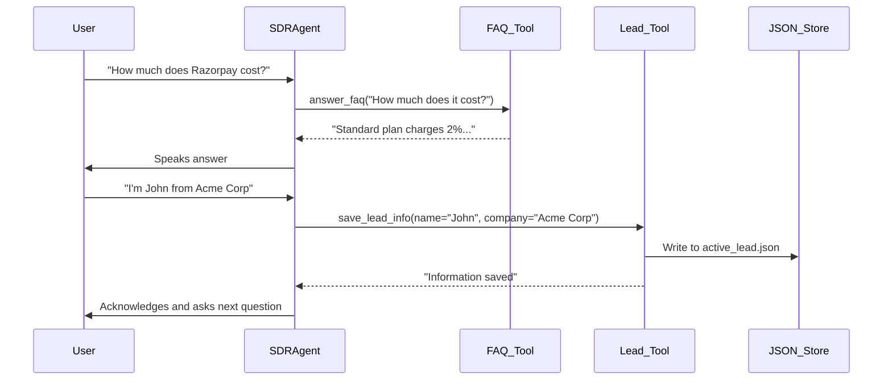

# Day 5 - Completion Report

## 📋 Task Summary

**Challenge:** Inbound SDR Voice Agent

**Date Completed:** November 26, 2025

---

## ✅ Objectives Completed

### Primary Goals
- [x] Pick a company (Razorpay - Indian Fintech)
- [x] Set up SDR persona (Anisha, Professional/Promo style)
- [x] Load company FAQ and pricing content
- [x] Implement FAQ answering capability
- [x] Collect structured lead information (Name, Company, Email, Role, etc.)
- [x] Generate end-of-call summary

### Advanced Goals (Optional)
- [ ] Mock Meeting Scheduler
- [ ] CRM-Style Call Notes
- [ ] Persona-Aware Pitching
- [ ] Follow-Up Email Draft
- [ ] Return Visitor Recognition

---

## 🛠️ Technical Implementation

### Changes Made

**Files Created:**
- `backend/src/agent_sdr.py` - Main SDR agent implementation.
- `backend/tests/test_sdr_logic.py` - Unit tests for agent logic.
- `backend/shared-data/company_data.json` - Razorpay company details, pricing, and FAQs.
- `backend/shared-data/lead_data.json` - Storage for collected leads (auto-created).

### Key Code Additions

**SDR Agent Persona:**
```python
self.session.tts = murf.TTS(
    voice="en-IN-Anisha", # Professional Indian female voice
    style="Promo",
    tokenizer=tokenize.basic.SentenceTokenizer(min_sentence_len=2),
    text_pacing=True,
)
```

**FAQ Answering Logic:**
```python
@function_tool()
async def answer_faq(self, context: RunContext, query: str):
    """Search the company FAQ to answer a specific question."""
    # ... keyword overlap logic ...
    if best_match and max_overlap > 0:
        return f"Here is what I found: {best_match['answer']}"
```

**Lead Collection Tool:**
```python
@function_tool()
async def save_lead_info(self, context: RunContext, name: str = None, ...):
    """Save collected lead information."""
    # Updates internal state and writes to JSON
    if name: self.lead_info["name"] = name
    # ...
    with open(active_file, "w") as f:
        json.dump(self.lead_info, f, indent=2)
```

---

## 🎯 Key Features Implemented

1. **Company Context (Razorpay)**
   - Loaded from `company_data.json`
   - Includes detailed product list (Payment Gateway, RazorpayX, etc.)
   - Specific pricing model (2% standard, 3% international)

2. **Intelligent FAQ Handling**
   - Uses keyword intersection to find the most relevant FAQ entry
   - Falls back to general product/pricing info if no specific match found

3. **Structured Lead Capture**
   - Collects 7 key data points: Name, Company, Email, Role, Use Case, Team Size, Timeline
   - Updates data incrementally as the conversation progresses
   - Persists data to JSON for CRM integration

4. **Professional Voice Experience**
   - Uses Murf AI's "Anisha" voice for a localized, professional Indian accent suitable for Razorpay
   - "Promo" style for engaging delivery

---

## 🏗️ Architecture & Technologies

### Key Technologies Stack
- **LiveKit Agents SDK**: Orchestration
- **Google Gemini 2.5 Flash Lite**: LLM for conversation
- **Murf TTS**: High-quality voice synthesis
- **Cartesia STT**: Speech recognition
- **JSON**: Lightweight data storage for company content and leads

### Data Flow



---

## 🧪 Testing & Validation

### Unit Tests
- `backend/tests/test_sdr_logic.py` covers:
    - Exact and partial FAQ matching
    - Fallback responses for unknown questions
    - Lead info saving and updating
    - End-of-call summary generation

### Manual Verification
- Verified agent loads Razorpay data correctly
- Verified voice selection (Anisha) works
- Verified leads are saved to `shared-data/lead_data.json`
  ```json
  [
    {
      "name": "Hara",
      "company": "Ind company",
      "email": "Haraind@email",
      "role": "Relationship Manager",
      "use_case": "UPI services",
      "team_size": "50",
      "timeline": "Last week of next month"
    }
  ]
  ```

---

## 💡 Learnings & Insights

1. **Tool Design for Data Collection**
   - Creating a specific tool (`save_lead_info`) with optional arguments allows the LLM to extract and save information naturally as it comes up, rather than forcing a rigid form-filling flow.

2. **Context Management**
   - Loading static company data (FAQs, pricing) into the system prompt or making it available via tools is crucial for accuracy. For larger datasets, a vector DB (RAG) would be better, but for this MVP, JSON lookup works well.

3. **Voice Selection Importance**
   - Choosing a localized voice (en-IN-Anisha) significantly enhances the realism for an Indian company like Razorpay.

---

## 📝 Next Steps

- [ ] Implement RAG for larger FAQ datasets
- [ ] Connect to a real CRM (HubSpot/Salesforce) via MCP
- [ ] Add "Meeting Scheduler" advanced goal
